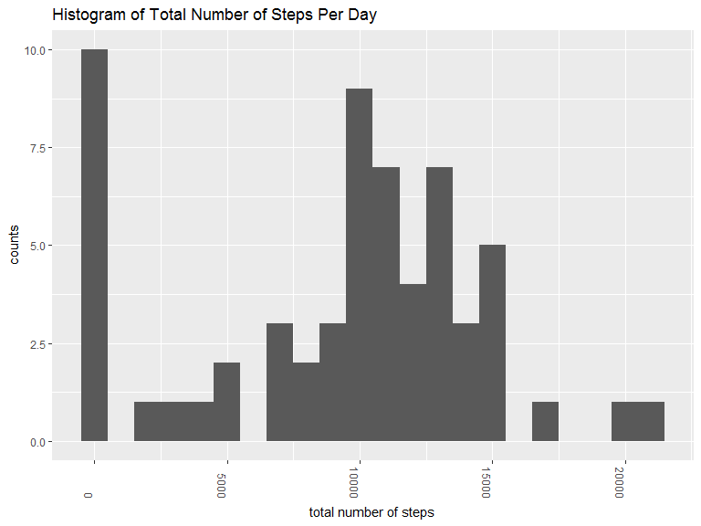
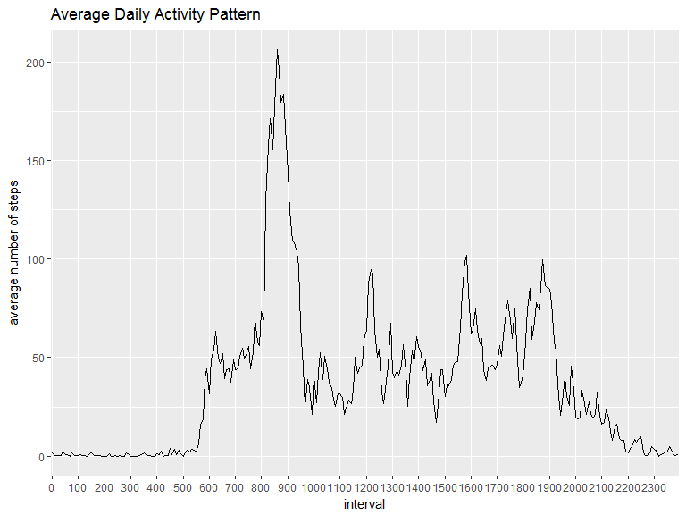
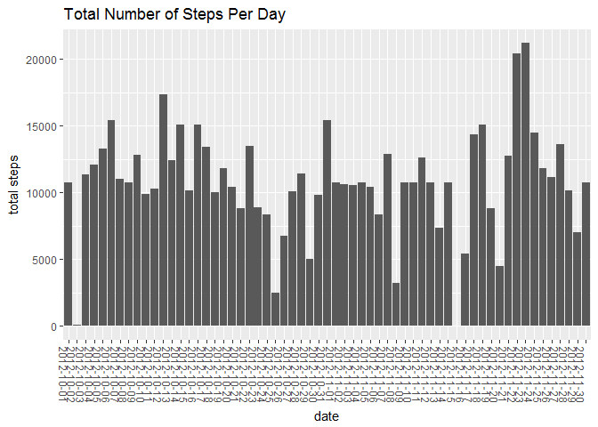
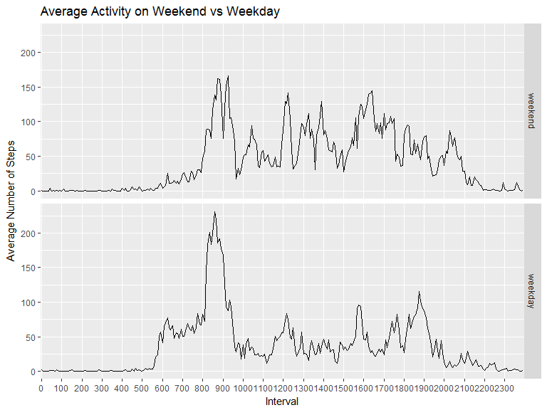

## Loading and preprocessing the data

```r
unzip("activity.zip")
data <- read.csv("activity.csv")
```


## What is mean total number of steps taken per day?
Let's make a histogram of the total number of steps taken each day, ignoring the missing values for now.

```r
library(dplyr)
```

```
## 
## Attaching package: 'dplyr'
```

```
## The following objects are masked from 'package:stats':
## 
##     filter, lag
```

```
## The following objects are masked from 'package:base':
## 
##     intersect, setdiff, setequal, union
```

```r
library(ggplot2)
daytotal <- data %>% select(steps,date) %>% group_by(date) %>% summarize(total = sum(steps, na.rm = TRUE))
daytotal %>% ggplot(aes(total)) + geom_histogram(binwidth = 1000) + labs(y="counts", x = "total number of steps", title = "Histogram of Total Number of Steps Per Day") + theme(axis.text.x = element_text(angle = -90, hjust = 1))
```

<!-- -->

The mean and median number of steps per day are then, 

```r
mean(daytotal$total)
```

```
## [1] 9354.23
```

```r
median(daytotal$total)
```

```
## [1] 10395
```


## What is the average daily activity pattern?
Average each interval over all days.


```r
data$interval <- as.factor(data$interval)
avgact <- data %>% group_by(interval) %>% summarize(intavg = mean(steps, na.rm = TRUE))
avgact %>% ggplot(aes(interval, intavg, group = 1)) + geom_line() + labs(y="average number of steps", title = "Average Daily Activity Pattern") + scale_x_discrete(breaks = levels(data$interval)[c(T, rep(F, 11))])
```

<!-- -->

The interval that on average has the most steps is, 


```r
as.numeric(as.character(unlist(avgact[avgact$intavg == max(avgact$intavg),1])))
```

```
## [1] 835
```


## Imputing missing values
The number of rows with a missing value is, 


```r
sum(is.na(data$steps))
```

```
## [1] 2304
```


Let's use a simple strategy to replace all of the missing values.  I will use the mean value for that particular interval and create a new dataset, "data2," that is the same as "data," but with the missing values filled in.


```r
data2 <- data
for(i in 1:nrow(data2)){
        if(is.na(data2$steps[i])){
                data2$steps[i] = avgact$intavg[avgact$interval==data2$interval[i]]
        }
}
```


Make a histogram of total steps per day with this new dataset, 


```r
daytotal2 <- data2 %>% select(steps,date) %>% group_by(date) %>% summarize(total = sum(steps, na.rm = TRUE))
daytotal2 %>% ggplot(aes(total)) + geom_histogram(binwidth = 1000) + labs(y="counts", x="total number of steps", title = "Histogram of Total Number of Steps Per Day") + theme(axis.text.x = element_text(angle = -90, hjust = 1))
```

<!-- -->


The new mean and median are,

```r
mean(daytotal2$total)
```

```
## [1] 10766.19
```

```r
median(daytotal2$total)
```

```
## [1] 10766.19
```


These are both larger than the previous mean and median estimate.  Imputing missing data increases the total number of steps per day.  This is because most of the missing data was for entire days.


## Are there differences in activity patterns between weekdays and weekends?

Add a factor variable to "data2" with two levels, "weekend" and "weekday" indicating when that particular date occured.


```r
data2$date <- as.Date(data2$date)
weekend <- weekdays(data2$date) %in% c("Saturday", "Sunday")
day <- factor(weekend, levels = c("TRUE", "FALSE"), labels = c("weekend", "weekday"))
data2 <- mutate(data2, day = day)
```


Average the number of steps for each combination of weekday/weekend and interval.  Make a panel plot comparing average activity on the weekend and weekdays.


```r
data2day <- data2 %>% group_by(day, interval) %>% summarize(intavg = mean(steps))
data2day %>% ggplot(aes(interval, intavg, group=1)) + facet_grid(day ~ .) + geom_line() + labs(y = "Average Number of Steps", x = "Interval", title = "Average Activity on Weekend vs Weekday") + scale_x_discrete(breaks = levels(data2day$interval)[c(T, rep(F, 11))])
```

<!-- -->


We can see that there are differences in activity between the weekend and weekdays.  For example, the person is more active in the morning on weekdays, and less active in the middle of the day, perhaps because they are at work.  
