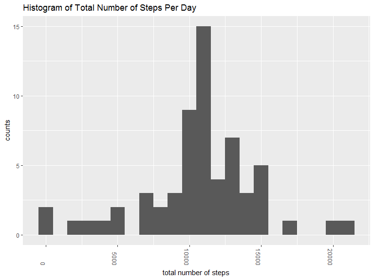

## Loading and preprocessing the data

```r
unzip("activity.zip")
data <- read.csv("activity.csv")
```


## What is mean total number of steps taken per day?
Let's make a histogram of the total number of steps taken each day.

```r
library(dplyr)
```

```
## 
## Attaching package: 'dplyr'
```

```
## The following objects are masked from 'package:stats':
## 
##     filter, lag
```

```
## The following objects are masked from 'package:base':
## 
##     intersect, setdiff, setequal, union
```

```r
library(ggplot2)
daytotal <- data %>% select(steps,date) %>% group_by(date) %>% summarize(total = sum(steps, na.rm = TRUE))
daytotal %>% ggplot(aes(date, total)) + geom_col() + labs(y="total steps", title = "Total Number of Steps Per Day") + theme(axis.text.x = element_text(angle = -90, hjust = 1))
```

<!-- -->

The mean and median number of steps per day are then, 

```r
mean(daytotal$total)
```

```
## [1] 9354.23
```

```r
median(daytotal$total)
```

```
## [1] 10395
```


## What is the average daily activity pattern?
Average each interval over all days.

```r
data$interval <- as.factor(data$interval)
avgact <- data %>% group_by(interval) %>% summarize(intavg = mean(steps, na.rm = TRUE))
avgact %>% ggplot(aes(interval, intavg, group = 1)) + geom_line() + labs(y="average number of steps", title = "Average Daily Activity Pattern") + scale_x_discrete(breaks = levels(data$interval)[c(T, rep(F, 11))])
```

<!-- -->

The interval that on average has the most steps is, 

```r
as.numeric(as.character(unlist(avgact[avgact$intavg == max(avgact$intavg),1])))
```

```
## [1] 835
```


## Imputing missing values
The number of rows with a missing value is, 

```r
sum(is.na(data$steps))
```

```
## [1] 2304
```

Let's use a simple strategy to replace all of the missing values.  I will use the mean value for that particular interval and create a new dataset, "data2," that is the same as "data," but with the missing values filled in.

```r
data2 <- data
for(i in 1:nrow(data2)){
        if(is.na(data2$steps[i])){
                data2$steps[i] = avgact$intavg[avgact$interval==data2$interval[i]]
        }
}
```

Make a histogram of total steps per day with this new dataset, 

```r
daytotal2 <- data2 %>% select(steps,date) %>% group_by(date) %>% summarize(total = sum(steps, na.rm = TRUE))
daytotal2 %>% ggplot(aes(date, total)) + geom_col() + labs(y="total steps", title = "Total Number of Steps Per Day") + theme(axis.text.x = element_text(angle = -90, hjust = 1))
```

<!-- -->

The new mean and median are,

```r
mean(daytotal2$total)
```

```
## [1] 10766.19
```

```r
median(daytotal2$total)
```

```
## [1] 10766.19
```

## Are there differences in activity patterns between weekdays and weekends?
